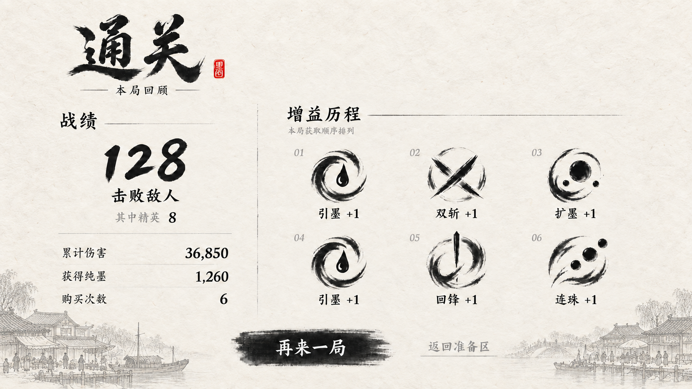

# Result HUD 美术实施方案

状态：最终参考图已由用户确认；本文件为实施方案，尚未制作或导入运行时资产。

## 1. 唯一美术验收基准

- 验收图：[result-hud-final-acceptance.png](result-hud-reference/result-hud-final-acceptance.png)。
- 来源：用户确认的市井建筑版附件，原文件名 `codex-clipboard-ff61ace0-a00f-4eeb-a8a0-60805bd27f0e.png`。
- SHA-256：`AB3D8EB5A7AF43C8747E137CB632FB3336FEDCFE9F4381516B65310D7B3F2A96`。
- 配套：[技术实施方案](result-hud-technical-implementation-plan.md)。

以本图的整体构图、宣纸明度、市井建筑位置、字体层级、图标密度和按钮关系为准。早期山水版不再作为实施基准。图中成绩和增益名称是示例数据，实际内容由运行时提供；图标必须与实际增益语义对应。

## 2. 整体视觉与构图

Result HUD 是独立全屏界面。浅暖宣纸铺满视口，不透出战斗场景；不沿用 Build HUD 的局内悬浮条、书册框架或技能栏。保留项目共有的黑色笔墨、飞白、细淡分隔线和小面积朱印。

底部左右采用接近《清明上河图》市井气质的临河店铺、瓦顶、棚檐、舟船、码头和少量人物线描。建筑为浅灰装饰层，中央按钮区域留白。按验收图复现装饰密度，不继续增加建筑、山水或大面积墨晕。

以下位置是根据验收图估计的归一化布局起点，最终以同尺寸叠图对齐为准，不将估算值当作新设计：

| 区域 | 位置与比例 | 视觉要求 |
| --- | --- | --- |
| 结果标题 | 左上约 x=10%～33%，y=3%～25% | 大字“通关”、小朱印、“本局回顾”及两侧短线 |
| 左侧战绩 | x=8.5%～34%，y=28%～79% | 击败数最大；精英为附注；其余三行标签左、数值右 |
| 中央分隔 | x≈37%，y=27%～81% | 细弱、局部断续的竖墨线 |
| 增益历程 | x=41%～90%，y=27%～79% | 标题与说明，三列两行，每项序号、图标、名称与增量 |
| 操作区 | y=85%～94% | 墨条主按钮，右侧文字次按钮 |
| 市井装饰 | 左右底边，主体集中于底部约20% | 建筑可贴边裁切，正文与按钮须保持干净 |

正文使用清晰的项目中文字体；大标题与击败数保留毛笔气质。次级文字可用灰墨，但应在目标分辨率清楚可读。红色仅用于小朱印。

## 3. 美术拆分交付

建议后续运行时资源目录为 `/Game/RawContent/UI/Result/`。本轮仅制定命名与要求，不创建这些 UE 资产。各纹理建议提供对应源 PNG 和导入后的同名 `.uasset`，下列尺寸是制作起点，可按实际显示和内存评估调整。

| 资源名 | 建议源图规格 | 内容与透明要求 |
| --- | --- | --- |
| `T_UI_Result_Paper` | 2048×2048，可平铺 | 浅暖宣纸纤维；完全不透明；无文字、建筑、墨边与光照暗角 |
| `T_UI_Result_TownLeft` | 1536×768 | 左侧市井、码头、船及边缘植物；背景透明 |
| `T_UI_Result_TownRight` | 1536×768 | 右侧沿河店铺、人物与桥岸；背景透明 |
| `T_UI_Result_TitleVictory` | 1024×512 | 仅“通关”书法字，透明背景，不含副标题或印章 |
| `T_UI_Result_TitleDefeat` | 1024×512 | 建议文案“落败”，笔墨与占位匹配通关；失败字形需补充美术验收 |
| `T_UI_Result_Seal` | 256×512 | 验收图小朱印，透明背景，装饰性印面不承担交互信息 |
| `T_UI_Result_PrimaryBrush` | 1024×256 | 纯黑飞白主按钮墨条，透明背景，不烘焙按钮文字 |
| `T_UI_Result_Divider` | 1024×32 | 细弱横向墨线；竖线如旋转效果不符，另交竖向版本 |

宣纸纹理需在目标比例保持自然纤维尺度；禁止将含文字的整张验收图用作运行时背景。底部建筑分别定位，避免超宽屏把房屋横向拉扁。透明装饰边缘不得带白边、灰色矩形底或棋盘格。

六项 Build icon 优先复用项目对应语义的正式图标，保持原宽高比，不从验收图裁下示意图标冒充真实增益。若实际类型缺少正式图标，列入缺项清单；临时占位须可识别，正式验收前处理。示例图中的重复增益不是错误，不合并其图标。

所有成绩、序号、名称、层数、正文和按钮文字由 UMG 绘制。只有结果标题可作为固定书法字纹理交付；未来本地化时需要对应语言资产或字体回退。

## 4. 动效所需美术配合

具体时序由技术方案定义，美术布局必须支持：

- 击败敌人数 → 累计伤害 → 获得纯墨 → 购买次数，逐项出现。
- 每项数值出现时播放一次 `1.0 → 1.5 → 1.0` 的 pulse。按数值中心缩放，正常位置与网格尺寸保持不变。
- “击败敌人”和“其中精英”随第一项显示；精英不增加独立的第五次 pulse。
- 数值外侧预留最大缩放所需空间：以原数值中心向各边至少增加原尺寸的25%，并对最大位数复核；不得侵入邻行、增益区或被裁切。
- 增益前六项按第一行左中右、第二行左中右逐一渐显。图标、序号和名称作为一组协调显现；不为图标增加 pulse、旋转或飞入。
- 背景纸纹、市井建筑保持静态；首版不增加人物走动、水波或视差。

交付时附静态完成态，以及最大 pulse 状态的排版检查图。动效不得要求使用已经烘焙了全部文字与图标的大图。

## 5. 适配与组件状态

以16:9为主要对齐比例，正文与图标区域整体等比适配。宣纸覆盖全视口，建筑独立锚定底边。窄屏仍保持三列两行，使用统一缩放和安全边距；不自动改成两列三行。超宽屏增加留白，避免拉伸字形和建筑。

主按钮需有正常、聚焦/悬停、按下、不可用四态；以墨色明暗、细线或微小位置反馈区分，不新增抢眼彩色边框。次按钮仍保持文字入口，聚焦态应可见。动效播放中两个按钮不可操作，完成后启用。

当前验收图只确认通关状态。失败页沿用同一布局及材质，拟采用“落败”标题；字形和替换后的完整画面应作为实施阶段补充验收项，不声称已获美术确认。

## 6. 美术验收清单

- [ ] 完整画面与指定验收图叠图核对，记录允许的字体与真实数据差异。
- [ ] 全屏浅色宣纸，无战斗背景透出、暗角、悬浮面板或书册边框。
- [ ] 左右市井建筑与验收图的密度、灰度、位置相符，中央按钮附近留白。
- [ ] 文字、图标和数字未烘焙进背景；纸纹不干扰汉字细笔画。
- [ ] 真实图标语义正确，重复项保留；六项按三列两行对齐。
- [ ] 统计 pulse 达到1.5时无碰撞、裁切或字形模糊；最终回到1.0。
- [ ] 1280×720、1920×1080、2560×1440，以及16:10、21:9画面均可读。
- [ ] PNG透明边缘和实际 UMG 渲染无白边，按钮聚焦状态可辨识。
- [ ] 失败标题单独补验；正式图标缺项与所有偏离验收图之处均有记录。

最终交付包括分层源文件、独立纹理、字体/字形说明、UE导入对象清单、静态完成态与pulse峰值截图。验收图本身仅保留为文档参考附件。
