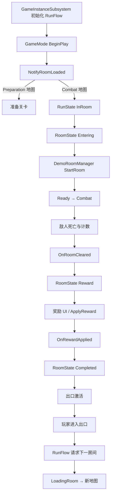

# 游戏链路更新说明（2026-08-06）

> 面向队友的同步文档。本文记录本次房间状态机切片，以及准备关卡跳过刷怪点检测的更新。

## 一句话结论

现在由地图 `GameMode` 管理当前房间状态，由 `URoguelikeRunFlowSubsystem` 管理跨地图的 Run 状态；`DemoRoomManager` 和 `RoguelikeRewardManager` 通过事件把战斗、清房和奖励结果交给 `GameMode`，不直接互相驱动下一层状态。

## 本次修改清单

本次没有新增独立 C++ 类，主要扩展了以下既有脚本：

| 文件 | 更新内容 |
| --- | --- |
| `Source/RiverOfInk/Script/GameMode/RiverOfInkGameMode.h/.cpp` | `GameMode` 持有 `CurrentRoomState`；订阅 RunFlow、房间管理器和奖励管理器事件；执行房间状态转移；在 `EndPlay` 解绑事件。 |
| `Source/RiverOfInk/Script/LevelRoomManager/DemoRoomManager.h/.cpp` | 增加 `OnRoomStarted`、`OnRoomCleared` 动态多播委托；在房间开始和清房时广播；准备关卡不再收集 `EnemySpawnPoint`，也不再自动启动战斗房间。 |
| `Source/RiverOfInk/Script/RoguelikeSystem/RoguelikeRunFlowSubsystem.h` | 将 `IsPreparationRoomMap(const UWorld*)` 暴露给地图内 C++ 逻辑，用 RunFlow 的准备地图配置判断当前世界。 |

依赖的已有模块包括 `RoguelikeRunTypes`、`RoguelikeRewardManager`、`RoguelikeExitTrigger` 和 `RoguelikeRuntimeDataSubsystem`，本次没有改变它们的职责边界。

## 两套状态的职责

### Run 状态：跨地图、由 GameInstanceSubsystem 持有

`ERoguelikeRunState` 当前包含：

```text
MainMenu → Preparation → LoadingRoom → InRoom → Result
```

它描述整局肉鸽流程，负责：

- 当前大关卡和房间索引
- 当前房间序列和房间地图加载
- 新局、下一房间、下一大关和重启
- 跨地图前的 RuntimeData Capture
- 地图加载完成后的状态确认

入口仍然是 `URoguelikeRunFlowSubsystem`，业务 Actor 不应直接调用 `OpenLevel`。

### Room 状态：地图内、由 GameMode 持有

`ERoguelikeRoomState` 当前为：

```text
Initializing → Entering → Ready → Combat → Reward → Completed → Exiting
```

它只描述当前已经加载的房间，不负责选择地图或保存跨场景数据。

允许的转移如下：

| 当前状态 | 触发来源 | 下一状态 |
| --- | --- | --- |
| `Initializing` | RunFlow 进入 `InRoom` | `Entering` |
| `Entering` | `DemoRoomManager::OnRoomStarted` | `Ready` |
| `Ready` | 同一个房间开始事件 | `Combat` |
| `Combat` | `DemoRoomManager::OnRoomCleared` | `Reward` |
| `Reward` | `RoguelikeRewardManager::OnRewardApplied` | `Completed` |
| `Completed` | RunFlow 开始 `LoadingRoom` | `Exiting` |

不允许跳跃式转移。例如 `Combat → Completed` 会被拒绝，必须先经过奖励状态。

## 当前运行链路



## 准备关卡的特殊处理

`TestMap_0` 是准备关卡，不是战斗房间。它只需要：

- 生成或激活开始出口
- 允许玩家进入出口开始新局
- 不启动敌人刷新
- 不要求 `EnemySpawnPoint`
- 不显示 Room Clear 奖励 UI

之前 `DemoRoomManager` 在所有地图都执行：

```text
CollectSpawnPoints()
→ bAutoStart 延迟调用 StartRoom()
→ 没有刷怪点时输出错误
```

现在 `BeginPlay` 会先向 RunFlow 查询当前 `UWorld` 是否等于配置的 `PreparationRoomMap`：

```cpp
if (RunFlow->IsPreparationRoomMap(World))
{
    UE_LOG(LogRoguelike, Log,
        TEXT("Preparation room detected; skipping enemy spawn setup."));
    return;
}
```

这里故意没有只判断 `GetRunState() == Preparation`。Actor 的 `BeginPlay` 可能早于 `GameMode::BeginPlay` 中的 `NotifyRoomLoaded`，此时 Run 状态还没有切到 `Preparation`；地图资产身份在这个时机已经可用，因此使用地图配置更稳定。

## 事件绑定规则

### GameMode 的绑定时机

`ARiverOfInkGameMode::BeginPlay` 中先订阅 RunFlow：

```cpp
RunFlow->OnRunStateChanged.AddDynamic(
    this, &ARiverOfInkGameMode::HandleRunStateChanged);
```

随后调用 `NotifyRoomLoaded`，最后通过 `BindRoomActors()` 找到当前地图中的 `DemoRoomManager` 和 `RoguelikeRewardManager` 并订阅它们的事件。

### EndPlay 必须解绑

地图切换会销毁当前 `GameMode` 和地图 Actor。`EndPlay` 中使用 `RemoveDynamic` 解绑，避免旧对象被事件系统继续调用，也避免 PIE 多次运行时重复订阅。

### 事件的所有权

```text
DemoRoomManager       发布房间开始/清房
RewardManager         发布奖励应用完成
GameMode              解释事件并推进 RoomState
RunFlowSubsystem      解释地图加载/出口推进并推进 RunState
```

事件发布者不直接拥有下一个状态的决策权，这样以后替换 UI、刷怪器或房间规则时，不需要把逻辑塞进同一个 Manager。

## 验证结果

### 编译

使用 UE 5.8 冷编译 `RiverOfInkEditor`，UHT、编译和链接均成功。输出中的 `TakeDamage` 隐藏基类函数警告和 NETFX SDK 路径警告属于已有问题，本次没有修改。

### PIE

在 `TestMap_0` 启动 PIE，日志出现：

```text
Preparation room detected; skipping enemy spawn setup.
Run state changed: 0 -> 1 Reason=1 MajorStage=-1 Room=-1.
Preparation start exit spawned and activated ...
```

本次 PIE 片段中没有再出现：

```text
RoomManager found 0 spawn points.
No spawn points found.
```

战斗房间分支仍然保留原有的刷怪点收集和自动开房逻辑；进入 `TestMap_1/2/3` 时才应看到 `RoomManager found ... spawn points`。

## 给队友的接入约定

1. 需要推进整局流程时调用 `URoguelikeRunFlowSubsystem` 的公开接口，不在房间 Actor 中直接 `OpenLevel`。
2. 需要响应房间阶段时订阅 `ARiverOfInkGameMode::OnRoomStateChanged`，不要在 UI 中自行猜测敌人数量。
3. 新增房间阶段时先扩展 `ERoguelikeRoomState` 和 `IsRoomTransitionAllowed`，再增加事件来源。
4. 准备关卡不要放置或依赖 `EnemySpawnPoint`；战斗关卡才配置 `DemoRoomManager` 的敌人和刷怪点。
5. 奖励 UI 选择完成后必须通过 `RoguelikeRewardManager::OnRewardApplied` 通知房间流，出口再负责等待玩家进入。

## 当前未覆盖项

- 奖励控件的 `Button_0/1 → SelectOption` 蓝图绑定仍需单独确认。
- `WBP_RoguelikeReward` 的部分占位图标资源路径仍有缺失警告。
- `Result`、失败重启和正式的多大关结算 UI 尚未接入。
- 当前 `OnRoomStarted` 会连续推进 `Entering → Ready → Combat`；如果以后需要开门动画或倒计时，应拆成独立事件。

本次工作树尚未提交，队友拉取后请先编译再打开 PIE。
